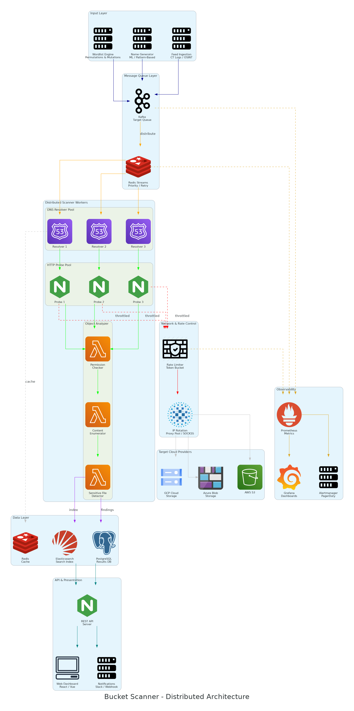

# Bucket Scanner - Cloud Storage Security Scanner

<p align="center">
  
</p>

A distributed, high-performance security scanner for detecting publicly exposed cloud storage buckets across AWS S3, Google Cloud Storage, and Azure Blob Storage.

## 🚀 Features

### Core Capabilities
- **Automated Enumeration**: Generate bucket names using patterns, wordlists, and permutations
- **Multi-Cloud Support**: Scan AWS S3, GCP Cloud Storage, and Azure Blob Storage
- **Public Access Detection**: Identify misconfigured buckets with proper pattern matching
- **Permission Analysis**: Check detailed bucket permissions and access levels
- **Content Analysis**: Discover sensitive files (credentials, keys, configs, etc.)
- **Rate Limiting**: Configurable rate limiting to avoid detection/blocking
- **IP Rotation**: Proxy pool support for distributed scanning
- **Real-time Notifications**: Slack/webhook alerts for critical findings

### Architecture Components
1. **Enumeration Layer**: Pattern-based and wordlist-based bucket name generation
2. **Input Layer**: Wordlist generation, name patterns, OSINT feeds
3. **Queue System**: Redis-based task distribution
4. **Scanner Workers**: DNS resolvers, HTTP probes, permission checkers
5. **Data Layer**: PostgreSQL for results, indexed with timeseries data
6. **REST API**: FastAPI-based API for integration
7. **Monitoring**: Prometheus + Grafana dashboards

## 📋 Prerequisites

- Docker & Docker Compose
- Python 3.11+ (for local development)
- (Optional) Cloud provider credentials for authenticated scanning

## 🚀 Quick Start

### 1. Clone and Setup

```bash
git clone <repository-url>
cd task001

# Copy environment file
cp .env.example .env

# Edit .env with your configuration
nano .env
```

### 2. Start with Docker Compose

```bash
# From project root
docker compose up -d --build
```

This will start:
- **API Server** (port 8000)
- **PostgreSQL** (port 5432)
- **Redis** (port 6379)
- **Worker Service**(s) (2 replicas by default)
- **Prometheus** (port 9090)
- **Grafana** (port 3000)

### 3. Verify Installation

```bash
# Check API health
curl http://localhost:8000/health

# View logs
docker compose logs -f api
docker compose logs -f worker
```

### 4. Access Services

- API Documentation: http://localhost:8000/docs
- Grafana Dashboard: http://localhost:3000 (admin/admin)
- Prometheus: http://localhost:9090

## 📚 Usage Examples

### Immediate Scan (Synchronous)

```bash
# Scan a bucket across all providers
curl -X POST http://localhost:8000/api/v1/scan/immediate \
  -H "Content-Type: application/json" \
  -d '{"bucket_name": "example-bucket"}'

# Scan specific provider
curl -X POST http://localhost:8000/api/v1/scan/immediate \
  -H "Content-Type: application/json" \
  -d '{"bucket_name": "example-bucket", "provider": "aws_s3"}'
```

### Queued Scan (Asynchronous)

```bash
# Queue a scan task
curl -X POST http://localhost:8000/api/v1/scan/queue \
  -H "Content-Type: application/json" \
  -d '{
    "bucket_name": "example-bucket",
    "priority": 10
  }'

# Check task status
curl http://localhost:8000/api/v1/task/{task_id}
```

### Bucket Name Enumeration

Generate potential bucket names automatically using patterns and wordlists:

```bash
# Generate bucket names for a company using patterns
curl -X POST http://localhost:8000/api/v1/enumerate \
  -H "Content-Type: application/json" \
  -d '{
    "company_name": "AcmeCorp",
    "max_names": 50,
    "use_wordlist": false,
    "auto_scan": false
  }'

# Generate names using wordlists
curl -X POST http://localhost:8000/api/v1/enumerate \
  -H "Content-Type: application/json" \
  -d '{
    "company_name": "Example",
    "max_names": 100,
    "use_wordlist": true,
    "wordlist_names": ["common", "aws-specific"],
    "auto_scan": false
  }'

# Generate and automatically queue for scanning
curl -X POST http://localhost:8000/api/v1/enumerate \
  -H "Content-Type: application/json" \
  -d '{
    "company_name": "Target",
    "max_names": 50,
    "use_wordlist": true,
    "auto_scan": true,
    "providers": ["aws_s3", "gcp_gcs"]
  }'

# List available wordlists
curl http://localhost:8000/api/v1/enumerate/wordlists

# Generate common public bucket patterns
curl -X POST http://localhost:8000/api/v1/enumerate/common-patterns \
  -H "Content-Type: application/json" \
  -d '{
    "limit": 100,
    "providers": ["aws_s3", "gcp_gcs", "azure_blob"],
    "auto_scan": true
  }'
```

**Enumeration Strategies:**
- **Pattern-based**: Generates names using common patterns (backup, data, uploads, etc.)
- **Environment-based**: Adds environment suffixes (prod, dev, staging, qa)
- **Purpose-based**: Combines purpose and environment (logs-prod, uploads-dev)
- **Date-based**: Includes year/month patterns (company-backup-2025)
- **Wordlist-based**: Uses curated wordlists for targeted scanning
- **Permutations**: Tests various separator combinations (-, _, .)

### Retrieve Results

```bash
# Get recent scan results
curl http://localhost:8000/api/v1/results?limit=10

# Get results for specific bucket
curl http://localhost:8000/api/v1/results/example-bucket

# Get all public buckets found
curl http://localhost:8000/api/v1/public-buckets

# Get security findings
curl http://localhost:8000/api/v1/findings?severity=critical
```

### Statistics

```bash
# Get overall statistics
curl http://localhost:8000/api/v1/statistics
```

## 🔧 Configuration

### Environment Variables

Key configurations in `.env` (at project root):

```bash
# Rate Limiting
MAX_REQUESTS_PER_SECOND=10
MAX_CONCURRENT_WORKERS=50

# AWS Credentials (optional - for deeper scanning)
AWS_ACCESS_KEY_ID=your_key
AWS_SECRET_ACCESS_KEY=your_secret

# GCP Credentials
GCP_PROJECT_ID=your_project
GCP_CREDENTIALS_PATH=/path/to/credentials.json

# Azure Credentials
AZURE_ACCOUNT_NAME=your_account
AZURE_ACCOUNT_KEY=your_key

# Notifications
ENABLE_NOTIFICATIONS=true
SLACK_WEBHOOK=https://hooks.slack.com/services/YOUR/WEBHOOK/URL
```

### Scaling Workers

```bash
# Edit .env at project root
WORKER_REPLICAS=5

# Restart services (from project root)
docker compose up -d --scale worker=5
```

## 🏗️ Project Structure

```
task001/
├── src/
│   ├── scanner/          # Cloud scanner implementations
│   │   ├── aws_scanner.py
│   │   ├── gcp_scanner.py
│   │   ├── azure_scanner.py
│   │   └── orchestrator.py
│   ├── workers/          # Worker components
│   │   ├── dns_resolver.py
│   │   ├── http_probe.py
│   │   ├── permission_checker.py
│   │   └── content_analyzer.py
│   ├── enumeration/      # Bucket name enumeration
│   │   ├── name_generator.py
│   │   └── wordlist_manager.py
│   ├── queue/            # Queue system
│   │   ├── producer.py
│   │   └── consumer.py
│   ├── api/              # REST API
│   │   ├── main.py
│   │   └── routes.py
│   ├── database/         # Database models
│   │   ├── models.py
│   │   └── repository.py
│   ├── utils/            # Utilities
│   │   ├── rate_limiter.py
│   │   ├── ip_rotator.py
│   │   └── notifier.py
│   └── config/           # Configuration
│       └── settings.py
├── wordlists/            # Enumeration wordlists
│   ├── common.txt        # General patterns
│   └── aws-specific.txt  # AWS-specific patterns
├── tests/                # Test suite
├── docs/                 # Documentation
│   ├── architecture_diagram.py
│   ├── API.md
│   ├── DEPLOYMENT.md
│   └── DEVELOPMENT.md
├── docker/               # Docker configuration
│   ├── Dockerfile        # Container build definition
│   └── prometheus.yml    # Monitoring configuration
├── docker-compose.yml    # Service orchestration (at root)
├── .env.example          # Environment template
└── requirements.txt
```

## 🔍 How It Works

### Detection Patterns

#### AWS S3
1. Anonymous LIST operation test
2. Bucket ACL analysis (AllUsers, AuthenticatedUsers)
3. Bucket policy parsing for public statements
4. Public Access Block settings check

#### GCP Cloud Storage
1. Anonymous GET/LIST operations
2. IAM policy analysis (allUsers, allAuthenticatedUsers)
3. Bucket-level permission checks

#### Azure Blob Storage
1. Anonymous container listing
2. Container properties (Public Access Level)
3. Blob-level access tests

### Risk Levels

- **Critical**: Public write access or public bucket with sensitive data
- **High**: Public bucket with sensitive files (credentials, keys, etc.)
- **Medium**: Public read-only bucket with files
- **Low**: Private bucket or public but empty

## 🧪 Testing

```bash
# Install dependencies
pip install -r requirements.txt

# Run tests
pytest tests/ -v

# With coverage
pytest tests/ --cov=src --cov-report=html
```

## 📊 Monitoring

### Grafana Dashboards

Access Grafana at http://localhost:3000:
- Default credentials: admin/admin
- Import pre-built dashboards for:
  - Scan statistics
  - Queue metrics
  - Worker performance
  - Finding trends

### Prometheus Metrics

- API request rates
- Scan success/failure rates
- Queue depth
- Worker status

## 🔒 Security Considerations

1. **Credentials**: Never commit credentials to version control
2. **Rate Limiting**: Respect cloud provider rate limits
3. **Legal**: Ensure you have permission to scan targets
4. **Network**: Use VPN/proxy for distributed operations
5. **Data**: Encrypt sensitive scan results at rest

## 🐛 Troubleshooting

### Common Issues

**Services won't start:**
```bash
docker compose down -v
docker compose up -d
```

**Worker not processing tasks:**
```bash
docker compose logs worker
docker compose restart worker
```

**Database connection issues:**
```bash
docker compose restart postgres
# Wait for health check, then:
docker compose restart api worker
```

## 📖 Documentation

- [API Documentation](docs/API.md) - Complete API reference
- [Deployment Guide](docs/DEPLOYMENT.md) - Production deployment
- [Development Guide](docs/DEVELOPMENT.md) - Local development setup

## 🤝 Contributing

1. Fork the repository
2. Create a feature branch
3. Make your changes
4. Add tests
5. Submit a pull request

## 📄 License

This project is licensed under the MIT License.

## ⚠️ Disclaimer

This tool is for security research and authorized testing only. Always obtain proper authorization before scanning systems you don't own. The authors are not responsible for misuse of this tool.

## 🙏 Acknowledgments

- Architecture inspired by distributed security scanning platforms
- Uses open-source libraries: FastAPI, SQLAlchemy, boto3, google-cloud-storage, azure-storage-blob

## 📞 Support

For issues, questions, or contributions:
- Open an issue on GitHub
- Check existing documentation
- Review logs: `docker compose logs -f`
